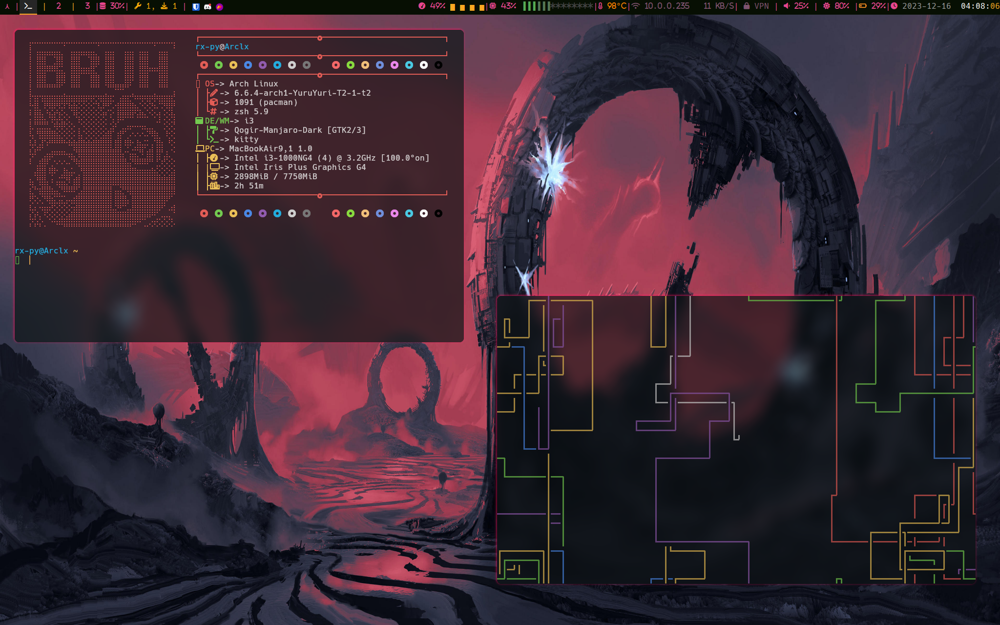
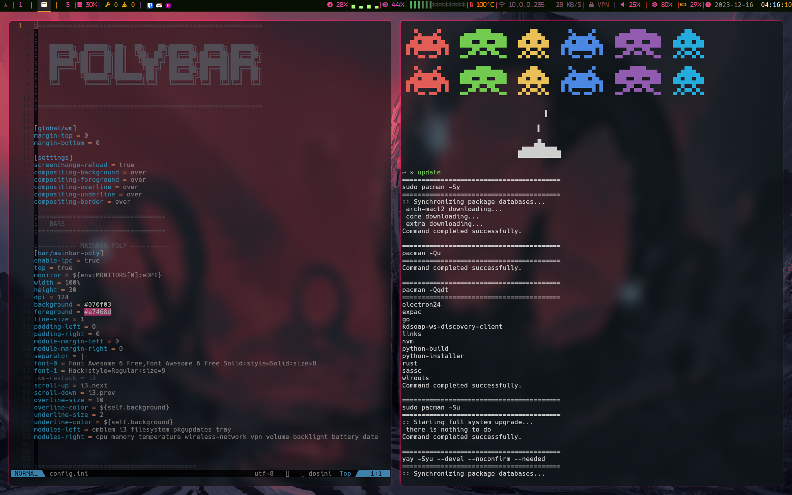
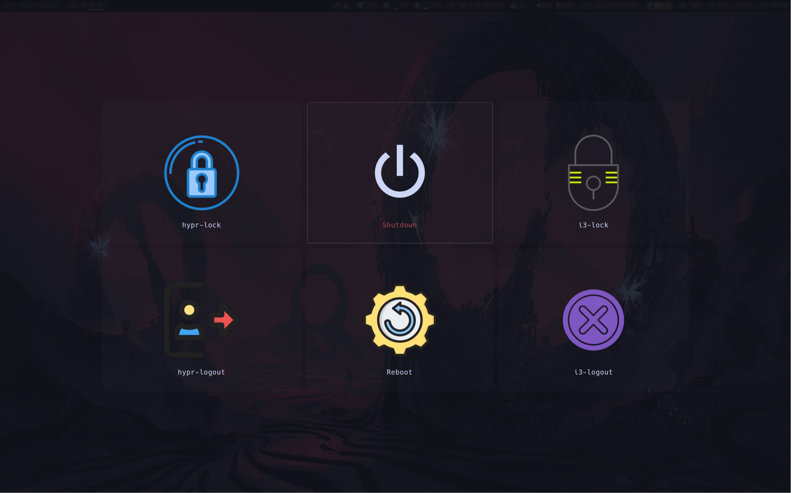

# i3wm-dotfi


<div  align="center">
  
[](https://github.com/rx-py/i3wm-dotfi.git)
[](https://github.com/rx-py/i3wm-dotfi.git)
<a href="https://github.com/rx-py/i3wm-dotfi/blob/main/LICENSE">
    
</a>
</div>

This repo holds the dotfiles for my i3-wm setup on Arch Linux which I intend to keep adding on this.


## Screenshots





## Installation

To use these configuration files, you need to have i3-window manager and some other needed dependences installed on your system. You can install it by running the following command:

```bash
yay -Syu base-devel NetworkManager network-manager-applet vim feh dunst zsh pamixer playerctl brightnessctl kitty neofetch thunar rofi ranger pulseaudio alsa-utils git firefox xrander pavucontrol nitrogen polybar sddm gtop flameshot firewalld eza cbonsai-git duf cava bluez-utils bluez blueman bitwarden asciiquarium --noconfirm --needed
```

And if you don't already have yay installed, you can follow this guide:
1. we first need to ensure that ```git``` and ```base-devel``` installed. These are required for building packages from the AUR.
```sudo pacman -S git base-devel```

2. Use ```git``` to clone yay repository from the AUR
```bash
git clone https://aur.archlinux.org/yay.git &&
cd yay
```

3.  Now we can build and install yay:
```makepkg -si```

This command will then prompt you to review the build process as well as its dependencies.


## Usage

To use these configuration files, simply copy the contents of this repository to which ever directory you would like.

Just an additional info, the third screenshot is of wlogout. You would notice that there are two logout buttons but that's just because wlogout is configured to work with both hyprland and i3-wm.


```bash
git clone https://github.com/rx-py/i3wm-dotfi.git 
cd i3wm-dotfi
```

```bash
cp -R ./. ~/
```

## Configuration Files

The following configuration files are included in this repository:

- `.configs`: This folder holds the main configs for the apps I use along with i3wm.
- `scripts`: This folder contains system scripts that allows for better functionality.
- `wal`: This folder would be where all images are stored


nvim theme = [ayu-dark](https://github.com/Shatur/neovim-ayu)

But from the screenshots, I have [transparency](https://github.com/xiyaowong/transparent.nvim) toggled so the ayu-dark theme isn't accurately displayed.


nvim with ayu-dark theme:

